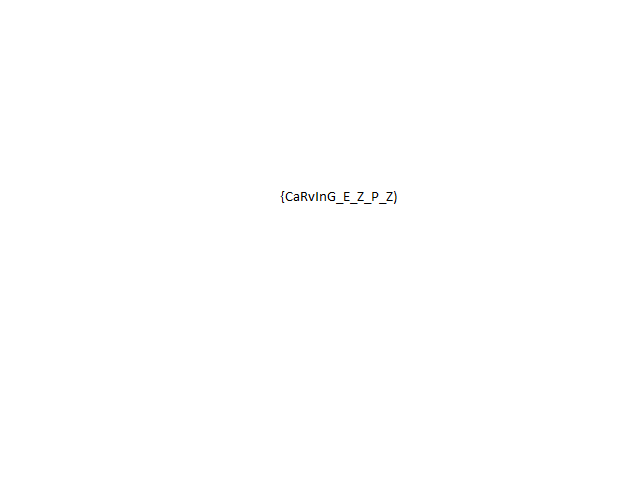

# CAMS CTF 2015: Carve

### Problem

**Points**: 50

**Description**: 

> Let's start with something easy.  
> carve.png

**Hint**: 

None given.

### Solution

Computers can generally detect how a file is formatted by looking at the file's signature, the first few bytes of a file. For some formats, the end of a file can also be determined by looking for an end-of-file marker; for the PNG format, the end-of-file marker is `IEND`. However, data can also be appended beyond the end-of-file marker; in these cases, these extra data are usually ignored by whatever program is reading the file.

[Binwalk](http://binwalk.org/) is a utility that allows you view and extract appended files. When we ran Binwalk on `carve.png`, we found a PNG appended at position `2367`: 

```
[!] binwalk -e carve.png 

DECIMAL   	HEX       	DESCRIPTION
-------------------------------------------------------------------------------------------------------
0         	0x0       	PNG image, 62 x 55, 8-bit/color RGB, non-interlaced
2367      	0x93F     	PNG image, 629 x 480, 8-bit/color RGB, non-interlaced

```

Using a hex editor of your choice (such as Bless), you can copy the bytes from position `2367` to the end to another file. The file that you carved out is another PNG, which contains the flag.



**Flag**: `{CaRvInG_E_Z_P_Z}`

### Other Resources

* None.
